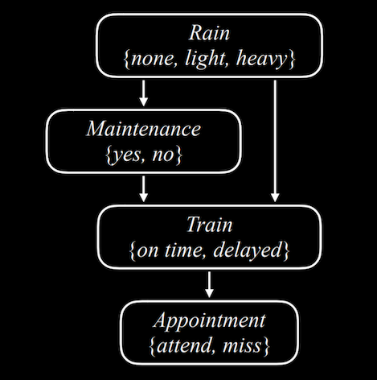
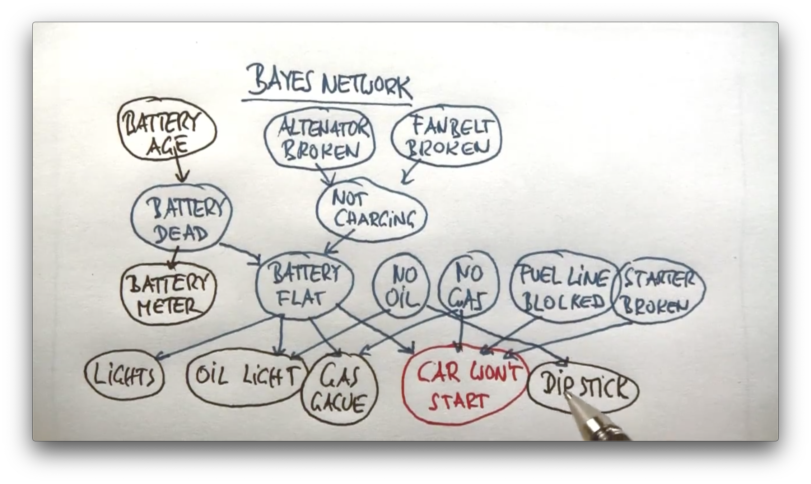

RED DE BAYES
============

Código del curso [CS50’s Introduction to Artificial Intelligence with Python](https://cs50.harvard.edu/ai/2024/), _lecture 2 "uncertainty"_, refactorizado a la nueva api de pomegranate v1.0.4 por [jmschrei](https://github.com/jmschrei/pomegranate/issues/1062)


## Instalación

Es necesario el uso del paquete [Pomegranate](https://pomegranate.readthedocs.io/en/stable/index.html):

> Pomegranate is a python package which implements fast, efficient, and extremely flexible probabilistic models ranging from probability distributions to Bayesian networks to mixtures of hidden Markov models.

`python -m venv venv`

`source venv/bin/activate`

Instalar la versión estricta de pomegranate `v1.0.4`:

`pip install -r requirements.txt`

o

`pip install pomegranate`

## Uso

### Red de Bayes

El código codifica la siguiente red de Bayes, en el módulo `model.py`:



Rain es el nodo raíz de la red. Rain es una variable aleatoria que toma los valores en el dominio atómico `{none, light, heavy}`. Su distribución de probabilidad es:

| none  | light | heavy |
| :---: | :---: | :---: |
|  0.7  |  0.2	|  0.1  |

Maintenance indica si se realiza mantenimiento en la red de transporte, tomando los valores atómicos `{yes, no}`. Rain es el nodo padre de Maintenance, lo que significa que su distribución de probabilidad se ve afectada por por Rain. 

| R     | yes | no  |
| :----:| :-: |:---:|
| none  | 0.4 | 0.6 |
| light | 0.2 | 0.8 |
| heavy | 0.1 | 0.9 |

Train es la variable que codifica si el tren llega `{on time, delayed}`. Maintenance y Rain son padres de Train, que implica que su distribución de probabilidad está condicionada por la de sus nodos padre:

 $$ P(X | Padres(X)) $$

| R     | M   | on time | delayed |
|:-----:|:---:|:-------:|:-------:|
| none  | yes | 0.8     | 0.2     |
| none  | no  | 0.9     | 0.1     |
| light | yes | 0.6     | 0.4     |
| light | no  | 0.7     | 0.3     |
| heavy | yes | 0.4     | 0.6     |
| heavy | no  | 0.5     | 0.5     |


Appointment toma los valores `{attend, miss}`. Es el único nodo padre de Train, indicando que lo que en última instancia afecta a llegar a tiempo a la cita es que el tren llegue puntual o no. Si el tren llega puntual, que llueva de manera torrencial o sea orballo no tiene efecto en llegar a tiempo a la cita.

| T        | attend | miss |
| :-------:|:------:|:----:|
| on time  | 0.9    | 0.1  |
| delayed  | 0.6    | 0.4  |

### Probabilidad conjunta

Calculamos la probabilidad de un determinado evento dada una observación, una observación de todas las variables, por lo que hablamos de probabilidad conjunta o _joint probabililty_.

¿Cual es la probabilidad de que no llueva, no se realice mantenimiento, el tren llegue puntual y asistamos a la cita?

$$ P(light)P(no | light)P(on time | light, no)P(attend | on time) $$

 $$ P(light, no, on time, attend) $$


```python
$ python likelihood.py

tensor([0.3402])
```

### Inferencia por enumeración

¿Cuáles son las distribuciones de probabilidades para todas las variables dada una evidencia, una observación?

Dada una observación o evidencia $e$, aplicamos la inferencia por enumeración iterando sobre las probabilidades de las variables ocultas $y$ :

 $$ P(X|e) = \frac{P(X,e)}{P(e)} = \alpha P(X,e) = \alpha \sum_{y} {P(X,e,y)} $$

Con la observación de que el tren se ha retrasado, calculamos las distribuciones de probabilidad de las variables Rain, Maintenance y Appointment.

```python
$ python inference.py

rain
    none: 0.4583
    light: 0.3069
    heavy: 0.2348
maintenance
    yes: 0.3567
    no: 0.6433
train
    on time: 0.0000
    delayed: 1.0000
appointment
    attend: 0.6000
    miss: 0.4000
```

`likelihood.py` y `inference.py` son dependientes del módulo `model.py`.

En el código de estos tres ficheros encontrarás la explicación de cómo se codifica la red de bayes en pomegranate.

#### Ejercicio

Intenta calcular la probabilidad de que llegar a tiempo o tarde a la cita, dependiendo de que el tren llegue puntual y haya lluvia fuerte.

¿Ha cambiado la probabilidad de atender a la cita respecto al ejemplo anterior? ¿Por qué?

Chequea la configuración en el fichero `inference_ejercicio.py`.

## Recursos sobre probabilidad y redes de Bayes

Mi compañero [@alejandro](https://github.com/avidaldo) del curso de especialización en IA y Big Data del IES de Teis en la modalidad a distancia ha preparado estos recursos en castellano: [Matemáticas para Machine Learning](https://github.com/avidaldo/mates_ml).

Recordad que esta práctica intenta cubrir los contenidos de los capítulos 12 _Quantifying Uncertainty_ y 13 _Probabilistic Reasoning_ del libro _IA, un enfoque moderno_ de Russell & Norvig. Allí encontraréis explicacos en profundidad los conceptos más importantes sobre teoría de probabilidad que explicamos de manera práctica en clase sobre estos dos supuestos prácticos:

* "Trata de arrancarlo" o "Un sistema de diagnóstico de averías inteligente como asistente para mecánicos", un ejemplo explicado por Sebastian Thrun en su famoso y pionero MOCC sobre IA: 



* Probabilidades sobre dos dados:


Los principios más importantes para comprender la teoría de probabilidades son:

* La letra griega $\Omega$ (omega mayúscula) representa al espacio de muestras, y $\omega$ (omega minúscula) se refiere a los elementos de ese espacio, es decir, a los posibles mundos.

* Los mundos posibles son mútuamente **exclusivos** y **exhaustivos**: dos posibles mundos no pueden existir a la vez, y uno de los posibles mundos debe producirse.

* Un modelo de probabilidad completamente especificado asocia una probabilidad numérica $P(ω$) con cada posible mundo.

* El axioma básico de la teoría de la probabilidad enuncia que todo mundo posible tiene una probabilidad entre 0 y 1, y que la probabilidad total del conjunto de posibles mundos es es 1:

$ 0≤P(ω)≤1 $ para todo $\omega$

$$ \sum_{w\in\Omega} P(ω)=1 $$
